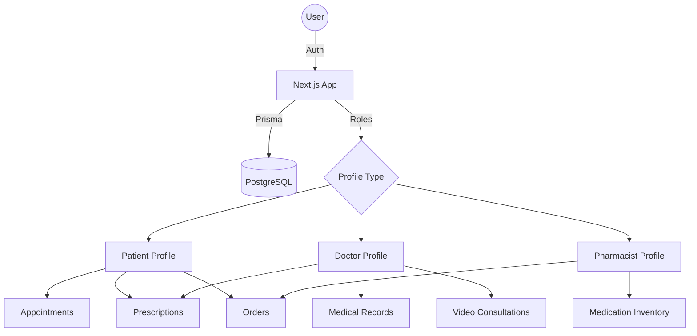

# Architecture

> Auto-generated by /map on 2026-03-31

## Overview

Kaku is a comprehensive healthcare and pharmacy platform built with Next.js. It supports multiple user roles including Patients, Doctors, and Pharmacists, facilitating telehealth, prescription management, and medication ordering.

## Components

### Authentication
- **Purpose:** Secure login and registration with role-based access.
- **Location:** `src/app/login`, `src/app/register`, `src/lib/auth.ts`, `src/lib/actions/auth.ts`
- **Details:** Uses `next-auth` for session management and `bcryptjs` for password hashing.

### Profiles
- **Purpose:** Role-specific data storage and management.
- **Location:** `src/app/patient`, `src/app/doctor`, `src/app/pharmacist`, `src/app/admin`
- **Details:** Split into role-based directories in the app router.

### Medical Records & Prescriptions
- **Purpose:** Managing patient health data and medication orders.
- **Location:** `src/lib/actions/medical.ts`, `src/lib/actions/prescription.ts`
- **Details:** Integrated with Prisma models for `MedicalRecordEntry` and `Prescription`.

### Telehealth
- **Purpose:** Video consultations between doctors and patients.
- **Location:** `src/app/(telehealth)/[role]/appointments/[id]/room`
- **Details:** Room-based video conferencing infrastructure (likely using a third-party SDK or custom WebRTC).

## Data Flow

1. **Authentication:** User logs in → `next-auth` session created → Middleware checks roles → Directed to appropriate dashboard.
2. **Consultation:** Doctor creates appointment → Patient receives notification → Both join the `room` at scheduled time.
3. **Prescription to Order:** Doctor issues prescription → Patient views and converts to order → Pharmacist processes order → Delivery status updated.

## Technical Debt

- [ ] **Lint Errors:** 161 issues found (101 errors, 60 warnings).
- [ ] **Type Safety:** Excessive use of `any` in library actions and auth files.
- [ ] **Unused Variables:** Many functions define parameters or variables that are never used.
- [ ] **Prisma Schema:** Complex relations might need optimization as the data grows.
