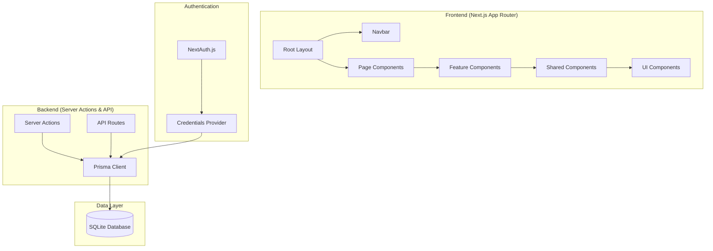

# Architecture

> Auto-generated by /map on 2026-03-31

## Overview

Kaku is an Integrated Digital Healthcare & Online Pharmacy Platform constructed with a modern Next.js 16 App Router architecture. It follows a modular design splitting concerns between UI, shared business logic, and domain-specific features.

## Components

### Core Layout (`src/app`)
- **Purpose:** Defines the application shell, routing, and global providers.
- **Location:** `src/app/`
- **Dependencies:** `next-auth`, `Geist font`, `Tailwind CSS`.

### Library (`src/lib`)
- **Purpose:** Contains core business logic, database initialization, and authentication configurations.
- **Location:** `src/lib/`
- **Sub-components:**
  - `prisma.ts`: Singleton Prisma client.
  - `auth.ts`: NextAuth configuration and providers.
  - `actions/`: Server actions for mutations (Auth, EMR, Appointments, etc.).

### UI System (`src/components`)
- **Purpose:** Nested component structure for maximum reusability.
- **Location:** `src/components/`
- **Sub-components:**
  - `ui/`: Base primitives (Buttons, Inputs, etc.) mostly from shadcn/ui.
  - `shared/`: Generic reusable components (Navbar, AuthProvider).
  - `features/`: Domain-specific components grouped by feature (EMR, Orders, etc.).

## Data Flow

1. **User Interaction:** User interacts with a Client Component (e.g., Register Form).
2. **Action Dispatch:** The component calls a Server Action defined in `src/lib/actions`.
3. **Validation & Logic:** The action validates input using **Zod** and performs business logic.
4. **Data Persistence:** The action uses the **Prisma** client to read/write to **SQLite**.
5. **Session Management:** **NextAuth** handles identity verification via JWT and callbacks.
6. **UI Update:** The page re-renders based on the action response or redirects.

## Integration Points

| Service | Type | Purpose |
|---------|------|---------|
| SQLite | Database | Primary data persistence |
| NextAuth | Auth | Identity and access management |
| Tailwind CSS | Styling | Design system and responsive layouts |

## Technical Debt

- [ ] **Deployment Readiness:** Currently hardcoded for SQLite; needs PostgreSQL migration for cloud hosting.
- [ ] **Placeholder Logic:** Some license numbers and IDs use `TEMP-` placeholders in actions.
- [ ] **Error Handling:** Standardized error boundaries and logging are partially implemented.
- [ ] **Testing:** Minimal automated test coverage observed for critical clinical paths.

## Conventions

**Naming:** PascalCase for components, kebab-case for directories, camelCase for functions/actions.
**Structure:** Feature-based folder organization for components.
**Testing:** Patterns identified in `__tests__` (if present) or hinted in `package.json`.
